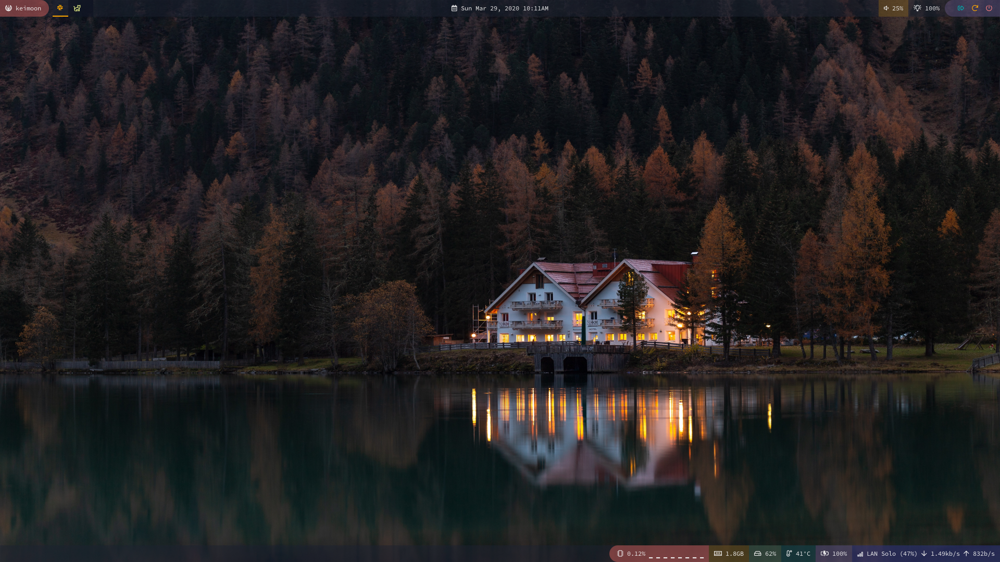
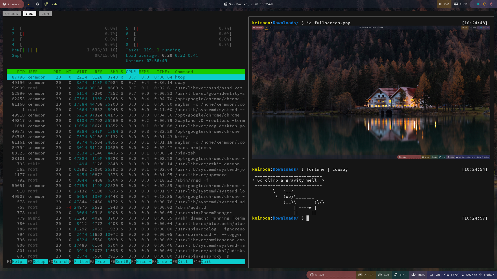
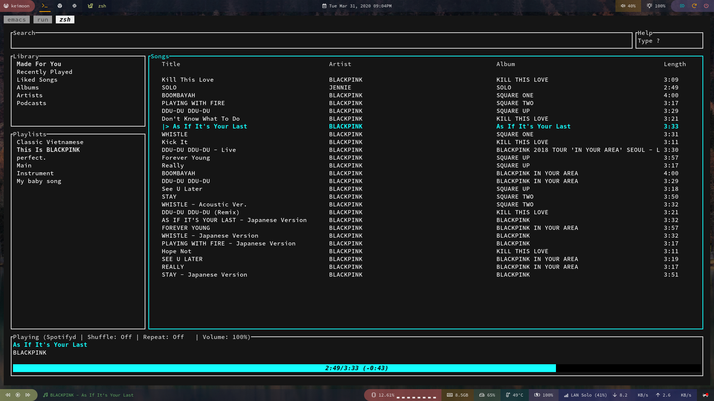

# Dotfiles

For:

 - i3 and sway (current WM)
 - polybar and waybar (current bar)
 - dunst and mako
 - kitty
 - zsh
 - emacs
 - compton (for the old i3)
 - betterlockscreen
 
## How to install
 
See [How to store dotfiles](https://developer.atlassian.com/blog/2016/02/best-way-to-store-dotfiles-git-bare-repo/)

TLDR:
 
```
alias config='/usr/bin/git --git-dir=$HOME/.dotconfig/ --work-tree=$HOME'
git clone --bare <git-repo-url> $HOME/.dotconfig
config checkout
```
 
## Screenshots






